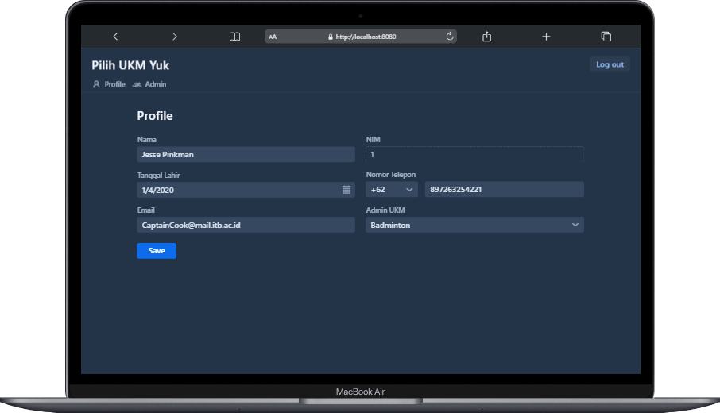
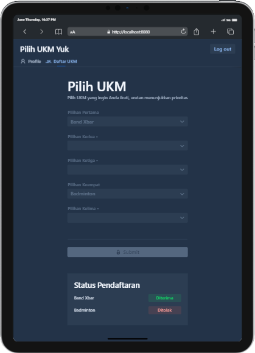
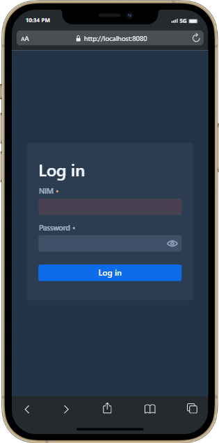
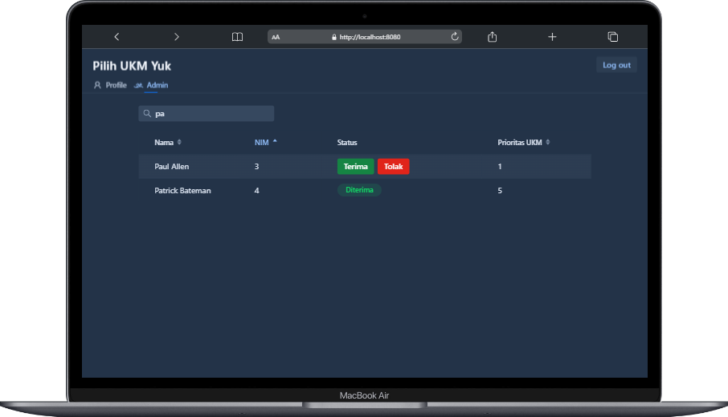

# [Pilih UKM Yuk](https://myproject666.herokuapp.com/)
[](https://wakatime.com/badge/user/ab053e7a-29dd-45e7-8ba6-5eaad830906f/project/1e23aed1-47d4-45be-af21-c2e19b9da29b)

[](#)


pilihukmyuk merupakan aplikasi sistem pendaftaran UKM yang dibuat untuk memudahkan mahasiswa dalam memilih UKM yang diinginkan, aplikasi ini juga memudahkan admin ukm untuk langsung menerima dan menolak mahasiswa yang mendaftar sehingga dapat mengurangi mahasiswa yang mendaftar UKM secara berlebihan. Pembuatan aplikasi ini menggunakan bahasa pemrograman Java, dengan menggunakan framework Vaadin. Aplikasi ini juga sudah di deploy di Heroku dan penyimpanan database menggunakan Postgres.

## Running the application (Pick One)
1. Open Your Favorite IDE and Run Application, open `http://localhost:8080/`
2. Open pilihukmyuk-1.0-SNAPSHOT.jar in "target" folder, open `http://localhost:8080/`
3. Open this link for Demo: https://myproject666.herokuapp.com/

[//]: # (## Deploying to Production)

[//]: # (1. `mvn package -Pproduction` &#40;Windows&#41; / `./mvnw clean package -Pproduction` &#40;Mac & Linux&#41;.)

[//]: # (2. `heroku deploy:jar target/pilihukmyuk-1.0-SNAPSHOT.jar -a myproject666` &#40;Deploy to Heroku&#41;)

[//]: # (## Project structure)

[//]: # ()
[//]: # (- `MainLayout.java` in `src/main/java` contains the navigation setup &#40;i.e., the)

[//]: # (  side/top bar and the main menu&#41;. This setup uses)

[//]: # (  [App Layout]&#40;https://vaadin.com/components/vaadin-app-layout&#41;.)

[//]: # (- `views` package in `src/main/java` contains the server-side Java views of your application.)

[//]: # (- `views` folder in `frontend/` contains the client-side JavaScript views of your application.)

[//]: # (- `themes` folder in `frontend/` contains the custom CSS styles.)

## Status Pendaftaran UKM
```
0 = Dalam Proses
1 = Diterima
2 = Ditolak
```

## Status Mahasiswa
```
0 = Belum Daftar UKM
1 = Sudah Daftar UKM
```

## Username dan Password
[List](username_pass.csv)

[Data generated from Online test data generator](https://www.onlinedatagenerator.com/)

[Date Generator](https://random.limited/date-time-generator/)
```
Username = Pick number 1-737
Password = Same as Username
```


### ENJOY!

## ScreenShot
<p align="center">
  
</p>

<p align="center">
  
</p>

<p align="center">
  
</p>

<p align="center">
  
</p>